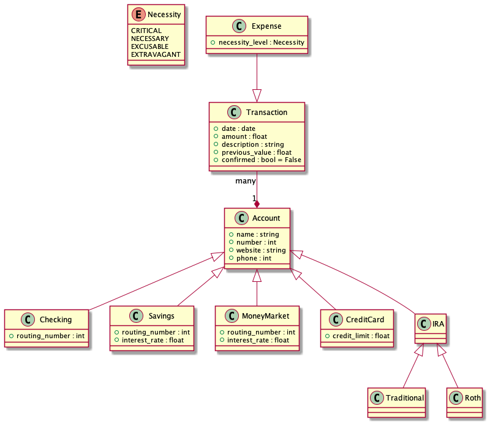
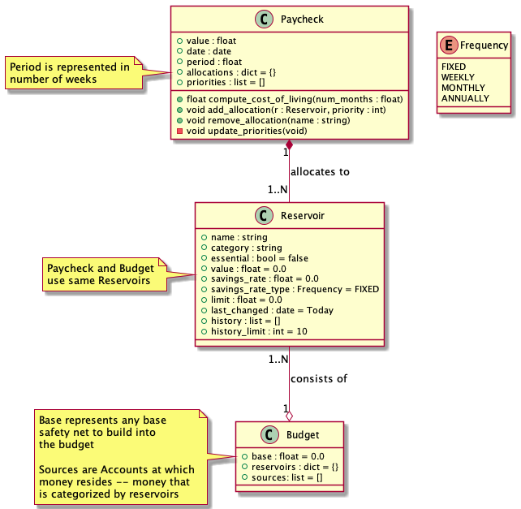

# Getting Started

## Overview

### Architecture & Design
Account Types



Relationship between Paycheck & Budget Classes



## Importing Libraries

# Testing
To run unit tests, execute the following from the command line:
```
python -m unittest discover .
```